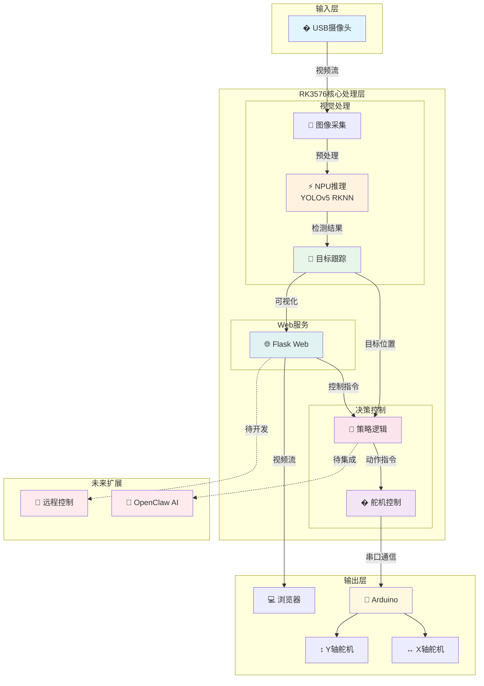

# RK3576 机器人视觉系统

> **人脸跟踪 + 物品识别 + 舵机控制**  
> 基于 RK3576 NPU 的视觉伺服控制系统

---

## 💡 项目说明

**本项目是学习 YOLO 目标检测和尝试使用 OpenClaw AI 功能开发的实践作品，目前仍处于半成品阶段，还有很多需要优化的地方。**

- 🎓 **学习目的**：通过本项目深入学习 YOLO 模型部署、RKNN 量化、嵌入式 NPU 推理
- 🤖 **AI 助手**：开发过程中使用 AI 辅助编程、调试和文档编写
- 🔮 **OpenClaw 集成**：已实现简单指令转发，未来计划支持手机/Discord 远程控制，让 OpenClaw 自主规划任务（如"跟踪这个人直到他离开房间"）
- 🚧 **当前状态**：基础功能已实现，但识别精度、跟踪稳定性、系统鲁棒性仍需提升
- 💬 **欢迎反馈**：如果你有任何建议或改进意见，欢迎提 Issue 或 PR！

---

## 📋 功能特点

| 功能 | 说明 |
|------|------|
| 🎯 **人脸优先跟踪** | 检测到人时自动跟踪人脸，忽略其他物品 |
| 🍎 **物品识别响应** | 无人脸时识别物品并执行对应动作： |
| | • 食物类 → 点头动作 |
| | • 学习用品 → 摇头动作 |
| | • 其他物品 → 转圈动作 |
| 🌐 **Web界面** | 实时视频流 + 控制面板 + 状态监控 |
| 🎮 **动作测试** | 支持手动触发点头/摇头/转圈动作 |
| ⚡ **NPU加速** | 使用 RK3576 NPU 进行实时目标检测 |

---

## 🏗️ 系统架构



## 🔧 硬件要求

| 设备 | 型号/规格 | 数量 |
|:------|:----------|:------:|
| 📟 开发板 | MYIR RK3576 | 1 |
| 📷 摄像头 | USB 摄像头 (≥640x480) | 1 |
| 🔌 Arduino | Arduino R4 Minima | 1 |
| ⚙️ 舵机 | SG90/MG90S (X轴+Y轴) | 2 |
| 🏗️ 云台 | 双轴舵机支架 | 1 |
| 🔗 数据线 | USB Type-C | 2 |

### 硬件连接图

```
┌─────────────────────────────────────────────────────────────┐
│                      RK3576 开发板                           │
│                                                             │
│  ┌─────────────┐         USB 连接         ┌──────────────┐ │
│  │   NPU 加速   │◄────────────────────────►│ Arduino R4   │ │
│  │  YOLOv5推理  │                          │   Minima     │ │
│  └─────────────┘                          └──────┬───────┘ │
└──────────────────────────────────────────────────┼──────────┘
                                                   │
                          ┌────────────────────────┼────────────┐
                          │                        │            │
                          ▼                        ▼            ▼
                    ┌──────────┐            ┌──────────┐  ┌──────────┐
                    │ D9 (X轴) │            │ D10(Y轴) │  │ 5V + GND │
                    └────┬─────┘            └────┬─────┘  └────┬─────┘
                         │                       │             │
                         ▼                       ▼             ▼
                    ┌──────────┐            ┌──────────┐  ┌──────────┐
                    │ X轴舵机  │            │ Y轴舵机  │  │   电源   │
                    │ 65°-115° │            │ 40°-90°  │  │          │
                    └──────────┘            └──────────┘  └──────────┘
```

---

## 🚀 快速开始

### 1. 环境准备

```bash
# 检查 NPU 驱动
ls /dev/dri/card1
sudo modprobe rknpu

# 检查摄像头
v4l2-ctl --list-devices
sudo chmod 666 /dev/video0

# 检查 Arduino
ls /dev/ttyACM*
sudo usermod -a -G dialout $USER
```

### 2. 安装依赖

```bash
cd /home/myir/Desktop/rk3576_robot_vision

# 创建虚拟环境
python3 -m venv venv
source venv/bin/activate

# 安装依赖
pip install flask opencv-python numpy pyserial
pip install rknn-toolkit2  # RK3576 SDK 提供
```

### 3. 启动应用

```bash
# 使用启动脚本（推荐）
./start_app.sh

# 或直接运行
python3 app.py
```

### 4. 访问 Web 界面

在浏览器中打开：
```
http://<开发板IP>:8888
```

---

## 📁 项目结构

```
rk3576_robot_vision/
├── app.py                      # Flask 主应用
├── config.py                   # 全局配置
├── start_app.sh               # 启动脚本
├── README.md                  # 本文件
├── requirements.txt           # Python 依赖
├── .gitignore                 # Git 忽略文件
├── docs/
│   └── TUTORIAL.md           # 📖 完整实现教程
├── core/                      # 核心模块
│   ├── __init__.py
│   ├── camera.py             # 摄像头管理
│   ├── detector.py           # NPU 检测器
│   ├── detector_cpu.py       # CPU 备用检测器
│   ├── tracker.py            # 目标跟踪
│   └── servo_controller.py   # 舵机控制
├── templates/
│   └── index.html            # Web 界面
├── static/                    # 静态资源
├── models/                    # 模型文件
│   ├── yolov5s_rk3576.rknn  # YOLOv5 RKNN 模型
│   └── coco.names            # COCO 类别名称
└── arduino_firmware/          # Arduino 固件
    ├── simple_robot.ino      # 简单舵机控制
    ├── final_robot/          # 完整机器人固件
    ├── head.cpp/h            # 头部控制模块
    ├── emoji.cpp/h           # 表情显示模块
    └── SERIAL_PROTOCOL.md    # 通信协议文档
```

---

## 🎮 使用指南

### 跟踪策略

1. **人脸优先**：画面中出现人脸时，只跟踪人脸，忽略其他物品
2. **物品响应**：无人脸时识别物品：
   - 食物类（苹果、香蕉、书本等）→ 点头动作
   - 学习用品（书、电脑、手机等）→ 摇头动作
   - 其他物品（椅子、杯子等）→ 转圈动作
3. **动作冷却**：每次动作后有 3 秒冷却时间，然后回到中心继续检测

### Web 控制面板

| 按钮 | 功能 |
|------|------|
| 🎯 回中心 | 舵机回到初始位置 |
| 🔄 重置跟踪 | 清除当前跟踪目标 |
| 👁️ 显示/隐藏检测框 | 切换检测框显示 |
| ↕️ 点头 | 测试点头动作 |
| ↔️ 摇头 | 测试摇头动作 |
| 🔄 转圈 | 测试转圈动作 |

---

## ⚙️ 配置说明

编辑 `config.py` 调整参数：

```python
# 舵机角度范围
SERVO_CONFIG = {
    "x_min": 65, "x_max": 115, "x_center": 90,  # X轴
    "y_min": 40, "y_max": 90, "y_center": 50,   # Y轴
}

# 检测阈值
YOLO_CONFIG = {
    "conf_threshold": 0.55,  # 置信度阈值
    "iou_threshold": 0.4,    # NMS阈值
}

# 类别映射
CATEGORY_MAPPING = {
    "face": ["person"],
    "food": ["banana", "apple", ...],
    "learning": ["book", "laptop", ...],
    "other": ["chair", "couch", ...]
}
```

---

## 🔍 常见问题

### Q: 摄像头无法打开
```bash
# 释放摄像头
fuser -k /dev/video0

# 检查权限
sudo chmod 666 /dev/video0
```

### Q: NPU 检测失败
```bash
# 加载驱动
sudo modprobe rknpu

# 程序会自动回退到 CPU 检测模式
```

### Q: 舵机不响应
```bash
# 检查串口权限
sudo usermod -a -G dialout $USER
newgrp dialout
```

### Q: 画面镜像
已在代码中自动水平翻转，如需调整修改 `core/camera.py`：
```python
frame = cv2.flip(frame, 1)  # 1=水平翻转, 0=垂直翻转
```

---

## 📖 详细教程

完整的一步一步实现教程请查看：
- [docs/TUTORIAL.md](docs/TUTORIAL.md)

包含：
- 硬件准备和连接
- 环境搭建详细步骤
- 代码逐行解释
- 系统架构图
- 问题排查指南
- 进阶优化建议

---

## 📝 版本历史

| 版本 | 日期 | 说明 |
|-----|------|------|
| v0.1 | 2024-01 | my_robot_vision 基础版 |
| v1.0 | 2024-02 | rk3576_robot_vision 完整版 |

---

## 📄 许可证

MIT License

---

## 🙏 致谢

- **AI 助手** - 开发过程中的智能助手，协助代码编写、调试和文档整理
- **Rockchip** - 提供 RK3576 NPU SDK 和 RKNN 工具链
- **YOLOv5** - Ultralytics 开源目标检测模型
- **Arduino** - 开源硬件平台

---

**GitHub**: https://github.com/520lake/rk3576_robot_vision  
**作者**: [520lake](https://github.com/520lake)  
**创建日期**: 2026-02-24  
**状态**: 🚧 持续优化中，欢迎 Star 和 PR！
